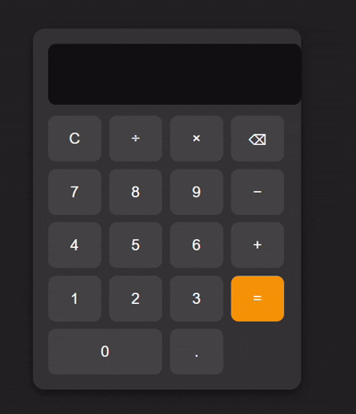

# JS-calculator-app
Simple Calculator App using HTML, CSS, and JavaScript with keyboard support and button press effect.
# Calculator App

A simple and interactive calculator application built with **HTML, CSS, and JavaScript**.  
Perfect for practicing JavaScript fundamentals and creating small web projects.

## Features
- Basic operations: addition (+), subtraction (-), multiplication (*), division (/)
- Decimal numbers support
- Keyboard support (type numbers and operators directly)
- Visual button press effect when clicking or pressing keys
- Clear (`C`) and delete (`⌫`) functionality

## Demo
You can try the live demo on GitHub Pages or Vercel once deployed.

## Installation / Usage
1. Clone the repository:
   ```bash
   git clone https://github.com/username/calculator-app.git

